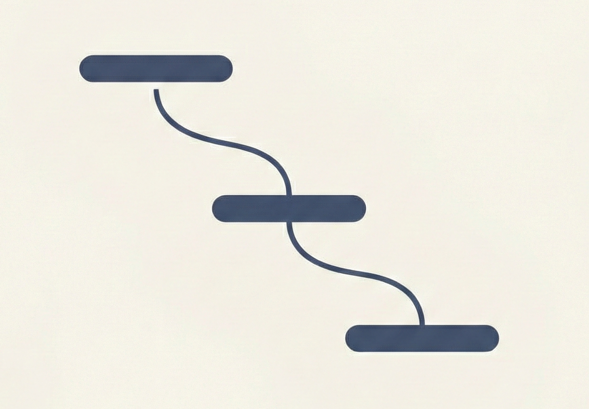
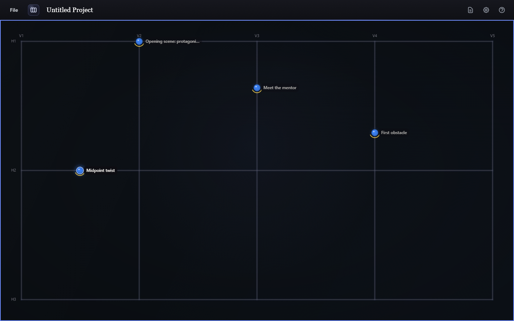
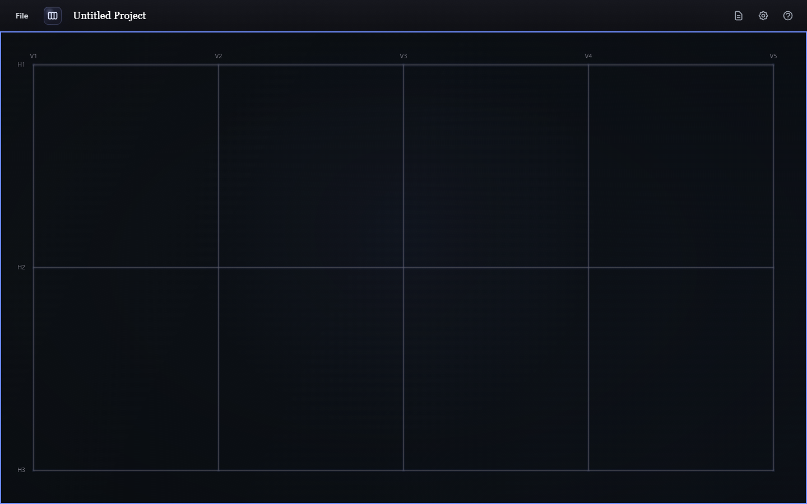
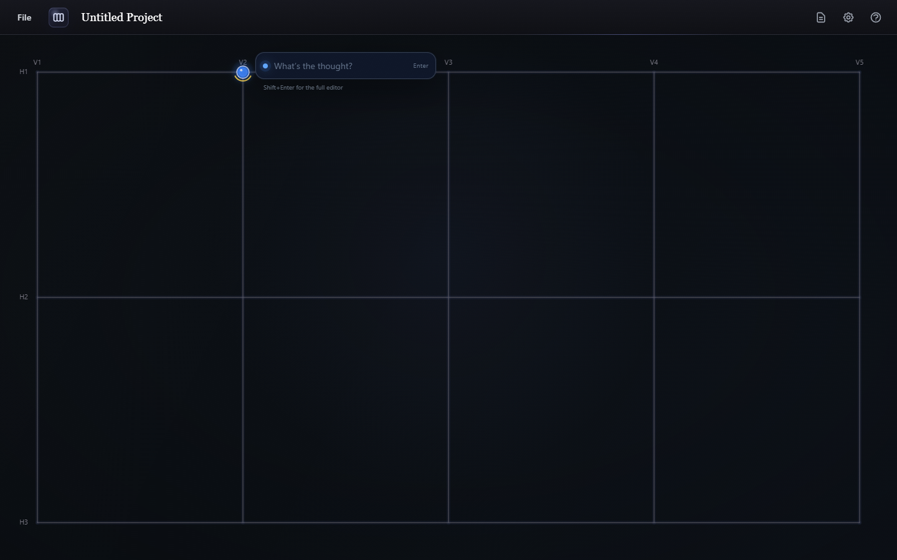
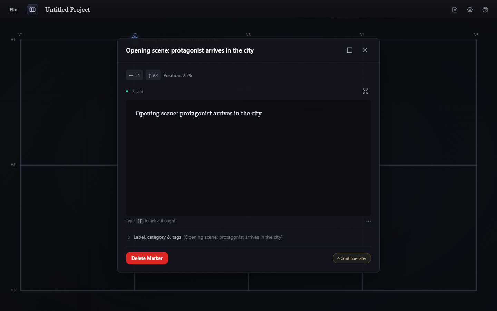
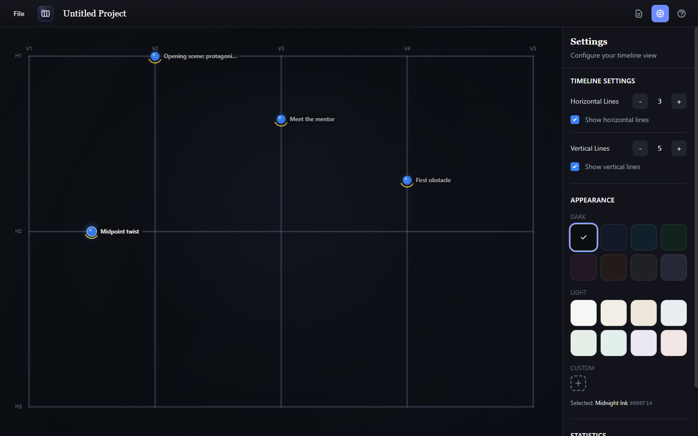

  

<h1 align="center">Likhi Lakeerain</h1>

<em>Written Lines</em> — a non-linear editor for organizing thoughts, scenes, and ideas on a grid instead of a single line.

  

## What is this?

Most editors force you to write top to bottom, start to finish. Likhi Lakeerain instead gives you a grid of horizontal and vertical lines and lets you drop **markers** — small notes with a title, rich text content, color, category, and tags — anywhere along those lines.

It's built for anything that isn't naturally linear: story outlines and branching narratives, mind maps, research notes, project plans, or any collection of ideas you want to see laid out spatially before you commit to an order.

Likhi Lakeerain is a free, open-source desktop app for Windows and macOS. Your projects are saved as files on your own machine — nothing is sent to a server.

## Download

Grab the latest build for your platform from the [Releases page](../../releases):

- **Windows** — download and run `likhi-lakeerain-windows-amd64.zip`, then launch `LikhiLakeerain.exe`
- **macOS** — download `likhi-lakeerain-darwin-universal.zip`, unzip, and drag `LikhiLakeerain.app` to Applications

> Want to build it yourself instead, or contribute code? See [DEVELOPER.md](DEVELOPER.md).

## Getting started

### 1. The grid

When you open a new project you'll see a grid of horizontal lines (`H1`, `H2`, ...) and vertical lines (`V1`, `V2`, ...). Think of the vertical lines as parallel threads — characters, storylines, workstreams, whatever you're tracking — and the horizontal lines as stages those threads pass through.

  

### 2. Add a marker

Click anywhere on a line to drop a marker there. A quick-add box pops up right on the canvas — type a thought and hit **Enter** to save it immediately, or **Shift+Enter** to jump into the full editor.

  

### 3. Edit a marker

Click any existing marker to open the full editor: a title, a rich text body (formatting, lists, links), and a **Label, category & tags** section for organizing it. Markers save automatically as you type.

  

### 4. Shape the grid to fit your project

Open **Settings** (the gear icon) to change the number of horizontal and vertical lines, toggle either axis on or off, adjust how close you need to click to a line for it to register, and pick a background theme — several dark and light presets, or a custom color.

  

### 5. Organize and compile

Use **tags** and **categories** to group related markers, and colors to tell them apart visually at a glance. When you're ready to turn your scattered markers into an ordered piece of writing, use **Compile** to arrange selected markers into a sequence — the order you'll actually use for the final output.

### 6. Save your work

Use **File → Save** (or **Save As**) to write your project to a `.json` file on disk, and **File → Open** to load one back up. Projects are just files — back them up, move them between machines, or put them under version control however you like.

## Tips

- **ESC** closes the marker editor without losing your changes (they're already saved).
- **Shift+Enter** in the quick-add box jumps straight to the full editor.
- Keep titles short — they're what you scan across the grid before opening a marker.
- Apply categories and tags as you go rather than after the fact; it's much less work than sorting everything at the end.

## Feedback and support

Found a bug or have an idea? Please [open an issue](../../issues) — bug reports, feature requests, and general feedback are all welcome.

## License

Likhi Lakeerain is licensed under the MIT License — see [LICENSE](LICENSE) for details.
